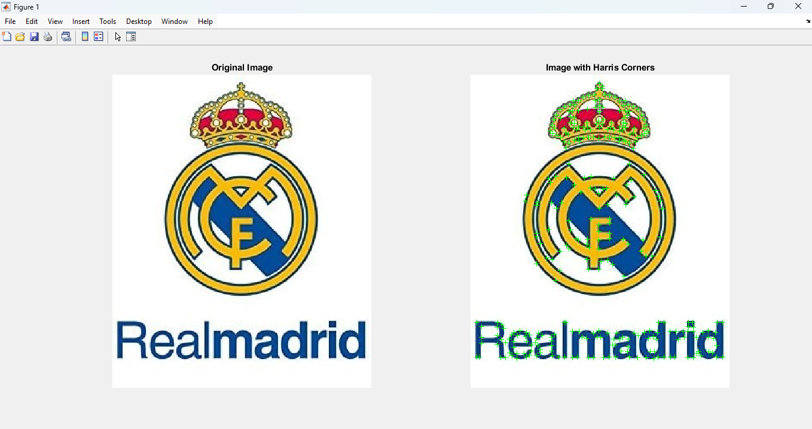

# Harris Corner Detection

This repository contains a MATLAB implementation of the Harris Corner Detection algorithm. The code processes a grayscale image to detect corners based on the eigenvalues of the gradient covariance matrix.

## Description

Harris Corner Detection is a popular method for detecting corners within an image. This implementation involves the following steps:
1. Converting the input image to grayscale.
2. Computing the image gradients using the Sobel operator.
3. Applying a Gaussian filter to smooth the gradient products.
4. Constructing the Harris matrix and computing its eigenvalues.
5. Normalizing the minimum eigenvalue.
6. Thresholding the eigenvalues to detect potential corners.
7. Applying non-maximum suppression to refine the detected corners.
8. Displaying the original image and the image with detected corners.

## Example

## Prerequisites

- MATLAB (tested with R2021a)
- Image Processing Toolbox

## Usage

1. Place your input image (e.g., `real_mad.jpg`) in the same directory as the script.
2. Run the script in MATLAB.

